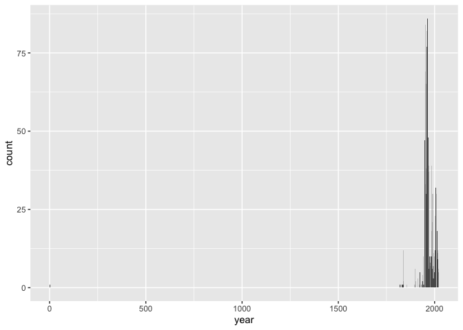
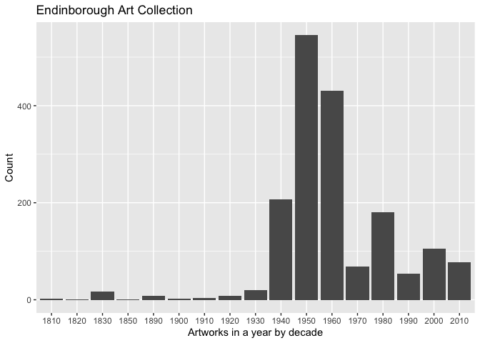

Lab 08 - University of Edinburgh Art Collection
================
Benjamin Egan
03/03/25

## Load Packages and Data

First, let’s load the necessary packages:

    ## Warning: package 'purrr' was built under R version 4.3.3

    ## Warning: package 'robotstxt' was built under R version 4.3.3

    ## Warning: package 'magrittr' was built under R version 4.3.3

    ## [1] TRUE

Now, load the dataset. If your data isn’t ready yet, you can leave
`eval = FALSE` for now and update it when needed.

## Exercise 9

Let’s start working with the **title** column by separating the title
and the date:

``` r
uoe_art <- uoe_art %>%
  separate(title, into = c("title", "date"), sep = "\\(") %>%
  mutate(year = str_remove(date, "\\)") %>% as.numeric()) %>%
  select(title, artist, year, link)
```

    ## Warning: Expected 2 pieces. Additional pieces discarded in 47 rows [182, 195, 209, 533,
    ## 729, 732, 771, 775, 781, 879, 982, 1029, 1041, 1045, 1132, 1176, 1279, 1336,
    ## 1358, 1359, ...].

    ## Warning: Expected 2 pieces. Missing pieces filled with `NA` in 697 rows [4, 15, 17, 22,
    ## 26, 27, 30, 31, 32, 34, 39, 41, 44, 53, 58, 63, 78, 82, 86, 93, ...].

    ## Warning: There was 1 warning in `mutate()`.
    ## ℹ In argument: `year = str_remove(date, "\\)") %>% as.numeric()`.
    ## Caused by warning in `str_remove(date, "\\)") %>% as.numeric()`:
    ## ! NAs introduced by coercion

The code was already provided, so I didn’t change anything. I’m guessing
the error related to “expected two pieces” is because not all pieces had
both a year and an author. I can see no author in some rows (182, 533,
etc.) but not in all of them. I’m also guessing that they filled in
these missing pieces with “NA.” There were probably rows that didn’t
have parentheses around years, adding to the confusion. One of the rows
just gave us a “2” for the year, probably adding to the confusion about
including the year.

``` r
skim(uoe_art)
```

|                                                  |         |
|:-------------------------------------------------|:--------|
| Name                                             | uoe_art |
| Number of rows                                   | 3312    |
| Number of columns                                | 4       |
| \_\_\_\_\_\_\_\_\_\_\_\_\_\_\_\_\_\_\_\_\_\_\_   |         |
| Column type frequency:                           |         |
| character                                        | 3       |
| numeric                                          | 1       |
| \_\_\_\_\_\_\_\_\_\_\_\_\_\_\_\_\_\_\_\_\_\_\_\_ |         |
| Group variables                                  | None    |

Data summary

**Variable type: character**

| skim_variable | n_missing | complete_rate | min | max | empty | n_unique | whitespace |
|:--------------|----------:|--------------:|----:|----:|------:|---------:|-----------:|
| title         |         0 |          1.00 |   0 |  95 |     5 |     1629 |          0 |
| artist        |       111 |          0.97 |   2 |  55 |     0 |     1198 |          0 |
| link          |         0 |          1.00 |  45 |  48 |     0 |     3312 |          0 |

**Variable type: numeric**

| skim_variable | n_missing | complete_rate |    mean |    sd |  p0 |  p25 |  p50 |  p75 | p100 | hist  |
|:--------------|----------:|--------------:|--------:|------:|----:|-----:|-----:|-----:|-----:|:------|
| year          |      1580 |          0.52 | 1964.56 | 53.22 |   2 | 1953 | 1962 | 1977 | 2020 | ▁▁▁▁▇ |

``` r
uoe_art %>%
  ggplot(aes(
    x = year
  ))+
  geom_bar()
```

    ## Warning: Removed 1580 rows containing non-finite outside the scale range
    ## (`stat_count()`).

<!-- -->

``` r
summary(uoe_art)
```

    ##     title              artist               year          link          
    ##  Length:3312        Length:3312        Min.   :   2   Length:3312       
    ##  Class :character   Class :character   1st Qu.:1953   Class :character  
    ##  Mode  :character   Mode  :character   Median :1962   Mode  :character  
    ##                                        Mean   :1965                     
    ##                                        3rd Qu.:1977                     
    ##                                        Max.   :2020                     
    ##                                        NA's   :1580

Using skim(), it appears that there are 111 artists missing from the
data frame. It also appears there are 1580 data missing from the year
column. One of the paintings shows a painting to be from the year 2.
Death mask had an additional number in the sequence. The year should be
1964.

``` r
#Change year for Death Mask
uoe_art_fixed <- uoe_art %>%
  mutate(year = case_when(
    year == "2" ~ "1964",
    .default = as.character(year)
  ))
view(uoe_art_fixed)


uoe_art_fixed <- uoe_art_fixed %>%
  mutate(decade = cut(as.numeric(year), 
                        breaks = seq(1810, 2030, by = 10), 
                        labels = seq(1810, 2020, by = 10), 
                        right = TRUE))


 ggplot(data=subset(
   uoe_art_fixed,
   !is.na(decade)), 
   aes(x=decade))+
  geom_bar()+
   labs(
     x = "Artworks in a year by decade",
     y = "Count",
     title = "Endinborough Art Collection"
   )
```

<!-- -->

Here I used a subset of the data that got rid of the missing years and
binned years to create decades. We can see there are a lot of artwork
created in the mid 1900s.

### Artist breakdown

``` r
uoe_art_fixed %>%
  count(artist, sort = TRUE)
```

    ## # A tibble: 1,199 × 2
    ##    artist               n
    ##    <chr>            <int>
    ##  1 Unknown            373
    ##  2 Emma Gillies       175
    ##  3 <NA>               111
    ##  4 Ann F Ward          23
    ##  5 John Bellany        22
    ##  6 Zygmunt Bukowski    21
    ##  7 Boris Bućan         17
    ##  8 Marjorie Wallace    17
    ##  9 Gordon Bryce        16
    ## 10 William Gillon      16
    ## # ℹ 1,189 more rows

The most common artist is unknown! This is followed by Emma Gillies and
N/A. Apparently this database doesn’t know a lot about their artworks.

### Art about children

``` r
filter(uoe_art_fixed, str_detect(uoe_art_fixed$title, "Child") == TRUE)
```

    ## # A tibble: 11 × 5
    ##    title                                               artist year  link  decade
    ##    <chr>                                               <chr>  <chr> <chr> <fct> 
    ##  1 "The Sun Dissolves while Man Looks Away from the U… Eduar… <NA>  coll… <NA>  
    ##  2 "Virgin and Child"                                  Unkno… <NA>  coll… <NA>  
    ##  3 "Virgin and Child "                                 Unkno… <NA>  coll… <NA>  
    ##  4 "Woman with Child and Still Life "                  Cathe… 1938  coll… 1930  
    ##  5 "Virgin and Child "                                 Unkno… <NA>  coll… <NA>  
    ##  6 "Child's collar. Chinese"                           Unkno… <NA>  coll… <NA>  
    ##  7 "Child's chinese headdress"                         Unkno… <NA>  coll… <NA>  
    ##  8 "Figure Composition with Nurse and Child, and Woma… Edwar… <NA>  coll… <NA>  
    ##  9 "Untitled - Children Playing "                      Monik… 1963  coll… 1960  
    ## 10 "The Children's Hour "                              Eduar… <NA>  coll… <NA>  
    ## 11 "Untitled - Portrait of a Woman and Child "         Willi… <NA>  coll… <NA>

I found all cases where the title contained child and filtered for them.
There are 11 total titles containing child/children.
